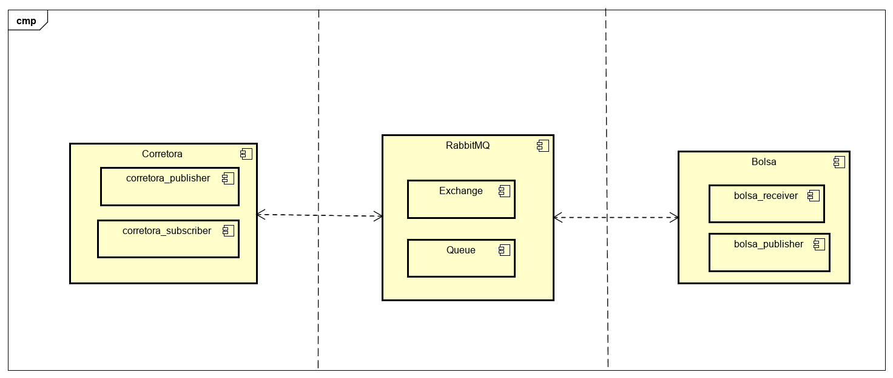

# Trabalho - Corretora de Valores com Rabbit MQ

**Daniel Lyncon Gonçalves de Souza, daniel.lyncon@sga.pucminas.br**

**Vitor Augusto Alves de Jesus, vaajesus@sga.pucminas.br**

**Professor: Hugo Bastos de Paula**

---

_Curso de Engenharia de Software, Unidade Praça da Liberdade_

_Instituto de Informática e Ciências Exatas – Pontifícia Universidade de Minas Gerais (PUC MINAS), Belo Horizonte – MG – Brasil_

---

**1. Introdução**

O Trabalho proposto tem como finalidade desenvolver uma aplicação que simule uma Bolsa de Valores por meio do Middleware 
RabbitMQ utilizando as estruturas de comunicação indireta Publish/Subscribe e Topics. O servidor RabbitMQ é escrito na linguagem de programação Erlang construído com o framework Open Telecom Platform para clustering e failover. O código foi desenvolvido na linguagem JavaScript 
utilizando o motor Node.js para gerenciar as bibliotecas externas responsáveis por manter a funcionalidade do Sistema pelo RabbitMQ. 

<!-- Na **contextualização**, o aluno deve dizer do que se trata o trabalho, em que área ou contexto se insere. 
A **contextualização** deve ser desenvolvida de algo mais genérico para algo mais específico. 
A citação de pesquisas quantitativas é bem aceita aqui (corretamente referenciadas).

Em seguida o aluno deve caminhar a contextualização para descrever o **problema** que o artigo trata. 
O **problema** pode ser algo vivido em uma empresa específica.

O aluno deve escrever um pequeno parágrafo ou frase com o **objetivo geral** do trabalho. 
O objetivo deve ser bem direto, específico e definido com verbos de ação (elaborar, propor, ava-liar, comparar etc.).
Apresente também alguns (pelo menos 2) **objetivos específicos** dependendo de onde você vai querer concentrar a 
sua prática investigativa, ou como você vai aprofundar no seu trabalho. Mostre também as **justificativas** para o 
desenvolvimento do seu trabalho e caso deseje, desta-que alguma contribuição do trabalho.

    1.1 Contextualização
    1.2 Problema
    1.3 Objetivo geral
       1.3.1 Objetivos específicos
    1.4 Justificativas -->

**2. Projeto de desenvolvimento**
O projeto consiste em 5 arquivos: bolsa_publish.js, bolsa_receiver.js, corretora_publish.js, corretora_subscribe e livro.js.
O bolsa_receiver é responsável por instanciar o servidor da bolsa de valores criando um canal de comunicação com nome 'BOLSADEVALORES' para o qual corretoras podem publicar compra e venda de ativos. Além disso, é responsável por gerenciar o 'match' entre uma compra e uma venda sempre que o valor de uma ORDEM DE COMPRA for maior ou igual ao valor de uma ORDEM DE VENDA para um mesmo ativo, a bolsa de valores gera uma mensagem do tipo TRANSACAO no tópico referente a compra/venda, e atualiza as ordens da fila em conjunto com o livro.js. Já o bolsa_publish é responsável por notificar as correteras inscritas no tópico de cada ativo seja de compra ou venda.

No arquivo corretora_publish é desempenhado o papel de enviar a bolsa de valores uma ordem de compra/venda de ativos utilizando a exchange do tipo topic. Enquanto no arquivo corretora_subscribe.js realiza a inscrição nos ativos que determinada corretora tem interesse em monitorar por meio de exchange do tipo pub/sub. 

	
**3. Modelagem de dados**

Foi desenvolvido o seguinte diagrama de componentes para ilustrar a arquitetura da solução:

**5. Avaliação**

A princípio o programa foi desenvolvido sem uma interface gráfica. Porém a partir da chamada via terminal em computadores diferentes, a comunicação foi devidamente estabelecida utilizando o RabbiMQ como MOM. Por exemplo, um computador roda o comando bolsa_.receiver.js para 'escutar' publicações de outros computadores que rodariam o comando corretora_publish.

**6. Conclusão**

A partir do trabalho desenvolvido, pôde-se concluir que o middleware RabbitMQ de fato pode ser utilizado em aplicações que necessitam de comunicação indireta. Além disso, possibilita ao desenvolvedor escolher qual tipo de exchange irá utilizar em seu projeto fornecendo rica documentação para consulta.
